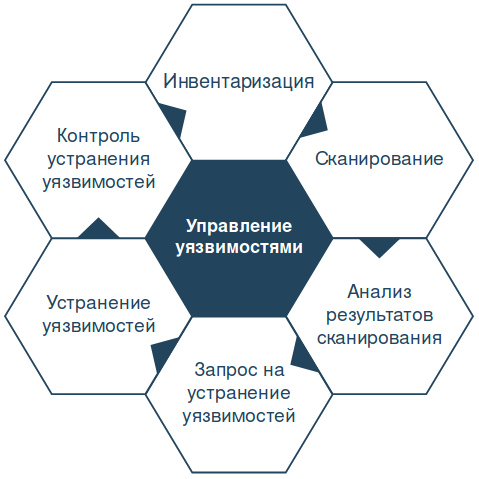

# Задание 1.
## Управление уязвимостями. Какие бывают уязвимости и где встречаются. Как их обнаруживать используя опенсорсные инструменты?

Думаю, что нет смысла говорить, что такое уязвимость, поэтому сразу к делу.

Управление уязвимостями - это циклический процесс, направленный на обнаружение и классификацию уязвимостей, а также на их устанение или снижение последствий их эксплуатации.

Если пошагово рассмотреть структуру процесса управления уязвимостями, то получается что-то похожее на круговую поруку

  **1.**  	Как правило, **начинается все с Инвентаризации**. Смысл в том, чтобы выявить все устройства в сети, разбить их на однотипные группы (уровень детализации такого разбиения может варьироваться в зависимости от масштабов сети клиента или наличия большого числа специфических устройств), выбрать группы, в отношении которых оказывается услуга, узнать лиц, ответственных за выбранные группы.

   Важно не просто разово провести эту процедуру, а выделить паттерны, чтобы в любое время понимать, что происходит в сети, находить новые устройства, находить старые устройства, которые переехали, находить новые подтипы внутри групп и прочее.

  **2.**  	**Сканирование** начинается с планирования. После получения всей необходимой информации о изучаемой сети составляется план-график сканирования на уязвимости. Периодичность сканирования может быть любой. Внешний периметр рекомендуется проверять значительно чаще, чтобы минимизировать риск эксплуаатции 1-day(только что опубликованных) уязвимостей. Та же рекомендация касается и публичных Web-ресурсов клиента.

Важно использовать несколько разных сканеров, а также брать во внимание уязвимости, которые не определяются стандартными инструментами. Необходимо перед сканированием убедиться, что сканеры умеют находить все публичные уязвимости, в противном случае, если стандартного инструментария не хватает, нужно проводить поиск отдельных уязвимостей вручную.
  
  **3.** **Анализ результатов сканирования.** Наверное, самое сложное - это из километрового списка однотипных записей найти то, что нужно оставить, а что нужно исправить, и в каком порядке действовать. 
| Параметры оценивания результатов |
| ------------- |
| Доступность уязвимого устройства/сервиса для потенциального нарушителя |
| Наличие публичного эксплойта |
| Сложность эксплуатации |
| Потенциальный риск для бизнеса |
| Не является ли ложным срабатыванием |
| Сложность устранения |
| Прочее... |

  **4.** В **Запрос на устранение уязвимостей** после обработки результатов попадают "проверенные и одобренные" уязвимости. Проводятся консультации с ответственными за уязвимые устройства, рассказывается что найдено, чем это грозит и какие варианты минимазации рисков есть.

  **5.** **Устранение уязвимостей.** На этом этапе команда разработки занимается устранением найденной уязвимости. Бывает, когда уязвимость устранить не получается (на это есть целый ряд причин), в этом случае применяются творческие меры усложняющие эксплуаатцию уязвимости.

  **6.** Также существует человеческий фактор, который позволяет игнорировать устранение уязвимостей. Чтобы контролировать это и проверять качество проделанно работы существует **Контроль устранения уязвимостей.** Если уязвимость закрыта, запускается проверка, чтобы убедиться, что уязвимости больше нет. Т.к. проверка запускается на одну уязвимость, она занимает немного времени. Если уязвимость закрыта - это подтвреждается, иначе отправляется на доработку.

# Какие бывают уязвимости и где встречаются?

Существует действительно много вариантов классификации уязвимостей. Например, классификация уязвимостей по степени риска, классификация уязвимостей по типу эксплуатации, классификации по уровню информационной структуры организации.

Я решил остановиться на варианте классификации по области происхождения.

| Уязвимости информационных систем. |
| ----------- |
| Уязвимости кода |
| Уязвимости конфигурации |
| Уязвимости архитектуры |
| Организационные уязвимости |
| Многофакторные уязвимости |

Уязвимости информационных систем по месту возникновения подразделяют на следующие:

#### Уязвимости ИС по месту возникновения
  **1. Уязвимости в общесистемном ПО.** К таким уязвимостям относятся уязвимости операционных систем, уязвимости систем управления базами данных, уязвимсоти специального инструментария, уязвимости общего програмного обеспечения.
  
  **2. Уязвимости в прикладном ПО.** Уязвимости офисных пакетов и иных типов прикладного ПО.
  
  **3. Уязвимости в специальном ПО.** Уязвимости микропрограмм в постоянных запоминающих устройствах, уязвимсоти базовой системы ввода-вывода, уязвимости ПО контроллеров управления.
  
  **4. Уязвимости в портативных технических средствах.** Уязвимости операционных систем мобильных устройств, уязвимости приложений для получения с мобильного устройства доступа в интернет.
  
  **5. Уязвимости в сетевом оборудовании.** Уязвимости маршрутизаторов, коммутаторов, уязвимости протоколов.
  
  **6. Уязвимости в средствах защиты информации.** Уязвимости в средствах управления доступом, средствах идентификации и аутентификации, средствах контроля целостности, средствах межсетевого экранирования.

> Также, разговаривая о уязвимостях, просто нельзя не упомянуть про [Топ 10 уязвимостей в веб приложениях](https://owasp.org/www-project-top-ten/)

> Материал взят из [ГОСТ Р 56546-2015 Защита информации. Уязвимости информационных систем. Классификация уязвимостей информационных систем](http://docs.cntd.ru/document/1200123702), [Угрозы, уязвимости и атаки в сетях](http://asher.ru/security/book/its/24), [Vulnerability (computing)
](https://en.wikipedia.org/wiki/Vulnerability_(computing))

# Как их обнаруживать используя опенсорсные инструменты?

несус 
кволес

# Задание 2.
## Топ 10 критических уязвимостей за последние 10 лет.
